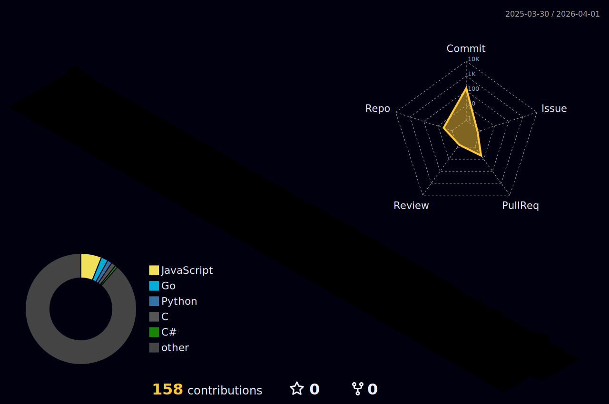

# 💫 About Me

I'm an engineer whose work spans aerospace, satellites, automotive systems, cloud infrastructure, and cybersecurity. Not because I couldn't pick a lane, but because what drives me has always been the same thing regardless of domain: understanding how complex systems actually work, and building them well.

I hold a double Bachelor's degree in **Aerospace Systems Engineering** and **Telecommunications (Network) Engineering** from the Polytechnic University of Catalonia. I've worked on embedded systems at **SEAT-CUPRA**, on the on-board computer of the 3Cat-8 nanosatellite at **NanoSat Lab**, and today I work across two fronts: as a software and DevOps engineer designing and deploying production-grade cloud-native infrastructure, and as part of the team building **Agora**, a digital platform for European university alliances. I am working toward the Hack The Box Certified Penetration Testing Specialist (HTB CPTS) and Certified Web Exploitation Expert (CWEE) certifications, with both paths completed and exams pending. I have also made open source contributions along the way. 

# 💻 Tech Stack
                             

# 📊 Highlights
<!-- Static cards generated daily by GitHub Actions -->

<!--  -->

